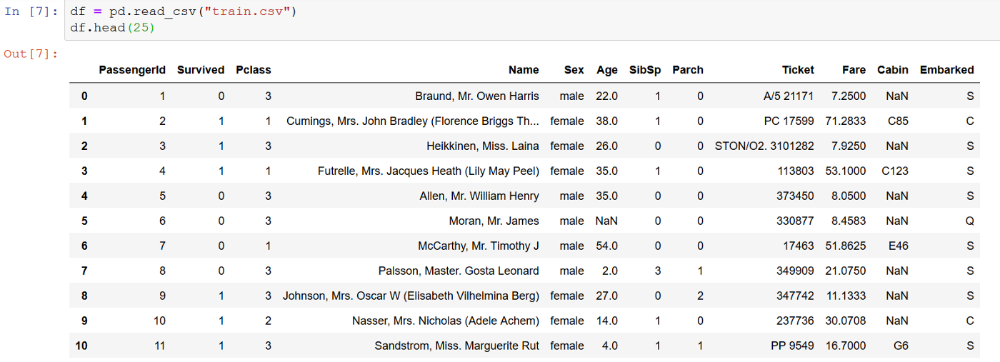

# SQL

## install pandasql

`!pip install pandasql`

## Примеры

```python
data = pd.DataFrame({
   "height":[162,180,170,155],
   "weight":[54.5,90, 50.1, 45.8],
   "sex":[1,0, 1, 0]
})
data
```


### выведем таблицу

```python
import pandasql as ps
ps.sqldf("select * from data")
```

### С условием

```python
ps.sqldf("select * from data where height>170")
```

### Подсчитаем число строк

`ps.sqldf = "select count(*) from data"`

### Сколько 


### Агрегаты

```python
ps.sqldf("select avg(height) from data")
ps.sqldf("select avg(height) from data group by sex")
ps.sqldf("select avg(weight) from data")
ps.sqldf("select avg(weight) from data group by sex")
```

Подсчитайте так же max(), min()

## Titanic

Скачайте датасет "Titanic", https://www.kaggle.com/datasets/hesh97/titanicdataset-traincsv, разархивируйте, положите в домашнюю директорию.


считайте файл в ячейке тетрадки:

```python
df = pd.read_csv("train.csv")
df.head(25)
```

Вы увидите подобную картину:

 

Значения колонок:

| Колонка | Значение      | Прмечание                      |
----------|---------------|---------------------------------
|survival |	Survival |	0 = No, 1 = Yes|
| pclass |	Ticket class |	1 = 1st, 2 = 2nd, 3 = 3rd|
| sex |	Sex 	
| Age |	Age in years 	
| sibsp |	# of siblings / spouses aboard the Titanic| 	
| parch |	# of parents / children aboard the Titanic |	
| ticket |	Ticket number 	|
| fare |	Passenger fare 	|
| cabin |	Cabin number 	|
| embarked | 	Port of Embarkation |	C = Cherbourg, Q = Queenstown, S = Southampton


### Разведочный анализ 

Использую SQL, попробуйте применить технику "разведочного анализа" к этому датасету, то есть сделать запросы и вывести что-то интересное.

Например:

* сумма всех проданных билетов
* средний возраст пассажира
* сколько женщин и мужчин было на борту
* отношение выживших ко всем пассажирам первого класса.
* тоже для всех трех классов

### Предсказания

Попробуйте сделать модель логистической регрессии (классификация) и предсказать вероятность гибели пассажира по каким-то числовым признакам, например, возраст, цена билета, класс, и другие. Воспользуйтесь кодом из другой тетрадки


